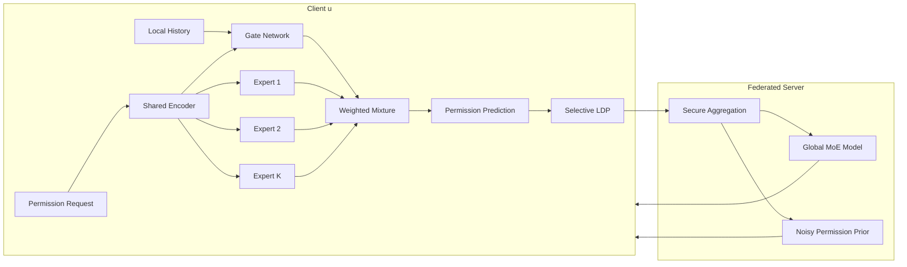

# PrivPerm：基于 Federated MoE 与 Selective LDP 的隐私保护权限预测框架

## 1. 研究动机

AI agent 在邮件、日程、文件系统和第三方服务中执行任务时，经常需要判断是否允许访问某类数据。这个问题表面上是权限预测，实际包含三个核心矛盾：

- **个性化**：不同用户面对同一权限请求时，可能有完全不同的风险偏好。
- **隐私性**：权限历史会暴露用户习惯、工作模式、敏感数据类型和服务使用偏好。
- **可用性**：如果只用强隐私保护而不考虑模型能力，预测性能会明显下降。

因此，我们设计 `PrivPerm`：一种结合联邦学习、多专家模型和本地差分隐私的权限预测框架。

核心思想：

- 用 `MoE` 建模不同类型用户的权限决策模式；
- 用 `Federated Learning` 避免原始权限数据上传到服务端；
- 用 `Selective LDP` 对最敏感的模型模块施加更强隐私保护；
- 专门分析 `gating leakage attack`，即门控网络可能泄露用户偏好类型的问题。

## 2. 系统架构



系统包含两个角色：

- **客户端**：保存用户本地权限历史，训练本地模型，并在上传前加入本地差分隐私噪声。
- **服务端**：只接收扰动后的模型更新，执行聚合，不直接接触用户原始权限记录。

## 3. 权限预测任务定义

设系统中共有 `M` 个用户：

```text
用户集合 = {用户1, 用户2, ..., 用户M}
```

每个用户 `u` 在本地有一组权限决策记录：

```text
用户u的数据 = {
  第1条权限请求及其决策,
  第2条权限请求及其决策,
  ...
}
```

每条样本由两部分组成：

```text
样本 = (权限请求, 用户决策)
```

其中用户决策是二分类标签：

```text
用户决策 = 1 表示 allow
用户决策 = 0 表示 deny
```

一次权限请求可以拆成五类信息：

```text
权限请求 = (query, receiver/tool, data type, context, local history summary)
```

含义如下：

- `query`：用户当前任务或自然语言请求；
- `receiver/tool`：请求访问数据的工具、服务或接收方；
- `data type`：被请求访问的数据类型；
- `context`：上下文信息，例如任务场景、来源、时间等；
- `local history summary`：用户本地历史偏好摘要，只保存在客户端。

模型目标：

```text
输入：一次权限请求
输出：建议授权的概率
```

也就是：

```text
预测概率越接近 1，越建议 allow
预测概率越接近 0，越建议 deny
```

## 4. Federated MoE 模型设计

### 4.1 上下文编码器

首先，模型把权限请求编码成一个向量表示。

```text
权限请求  →  上下文编码器  →  上下文向量
```

可以写成：

```text
z = Encoder(x)
```

其中：

- `x` 表示当前权限请求；
- `z` 表示编码后的上下文向量；
- `Encoder` 可以由文本 embedding、数据类型 embedding、工具类别 embedding 和 MLP 组成。

这一步的作用是把 query、tool、data type、context 等异构信息统一映射到同一个语义空间。

### 4.2 多专家模块

MoE 中有 `K` 个专家模型：

```text
Expert 1, Expert 2, ..., Expert K
```

每个 expert 学习一种权限决策模式。例如：

- `Expert 1`：学习 privacy-sensitive 用户的保守授权模式；
- `Expert 2`：学习 utility-driven 用户的效率优先模式；
- `Expert 3`：学习 context-dependent 用户的上下文敏感模式；
- 其他 expert 学习更细粒度的数据类型偏好或工具偏好。

每个 expert 都会根据上下文向量 `z` 给出自己的授权概率：

```text
第k个expert的输出 = p_k
```

其中：

```text
p_k 越接近 1，说明第k个expert越倾向于 allow
p_k 越接近 0，说明第k个expert越倾向于 deny
```

### 4.3 门控网络

门控网络负责判断：当前样本应该更相信哪些 experts。

它的输入包括：

```text
上下文向量 z
用户本地偏好向量 s
```

输出是每个 expert 的权重：

```text
Expert 1 的权重 = α1
Expert 2 的权重 = α2
...
Expert K 的权重 = αK
```

这些权重满足：

```text
α1 + α2 + ... + αK = 1
每个 αk 都大于等于 0
```

直观理解：

```text
如果 α3 最大，说明模型认为当前请求更适合交给 Expert 3 判断。
如果多个 α 都比较接近，说明模型采用更平滑的混合判断。
```

为了降低门控泄露风险，不建议使用 hard top-1 routing，而应使用 soft routing 或 top-2 soft routing。

### 4.4 最终预测

最终授权概率是所有 expert 输出的加权平均。

用人能直接读懂的形式写就是：

```text
最终授权概率
= Expert 1 的权重 × Expert 1 的预测
+ Expert 2 的权重 × Expert 2 的预测
+ ...
+ Expert K 的权重 × Expert K 的预测
```

也就是：

```text
y_hat = α1 × p1 + α2 × p2 + ... + αK × pK
```

其中：

- `y_hat` 是最终预测的授权概率；
- `αk` 是第 `k` 个 expert 的权重；
- `pk` 是第 `k` 个 expert 给出的授权概率。

决策规则：

```text
如果 y_hat ≥ γ，则建议 allow
如果 y_hat < γ，则建议 deny 或请求用户确认
```

其中 `γ` 是授权阈值，例如 `0.5`、`0.7` 或根据风险等级动态设置。

## 5. 训练目标

### 5.1 主任务损失

主任务是二分类：预测 allow 或 deny。

因此可以使用二元交叉熵损失。

直观理解：

```text
如果用户真实选择 allow，而模型预测概率很低，则惩罚很大。
如果用户真实选择 deny，而模型预测概率很高，则惩罚很大。
如果模型预测接近用户真实决策，则惩罚很小。
```

写成可读形式：

```text
任务损失 = 所有样本预测错误程度的平均值
```

### 5.2 门控熵正则

如果门控网络总是非常确定地选择某一个 expert，会产生两个问题：

- 某些 experts 过度使用，其他 experts 学不到东西；
- expert id 可能变成用户偏好的隐式标签，产生 gating leakage。

因此加入门控熵正则。

直观目标：

```text
不要让门控权重过早变成 one-hot。
```

例如：

```text
不希望出现：α = (0.99, 0.01, 0.00, 0.00)
更希望出现：α = (0.45, 0.35, 0.15, 0.05)
```

这样可以让路由更平滑，降低单个 expert 暴露用户类型的风险。

### 5.3 专家负载均衡正则

MoE 还需要避免所有样本都流向少数几个专家。

直观目标：

```text
每个 expert 都应该被适度使用。
```

如果共有 `K` 个 experts，理想情况下每个 expert 的平均使用率接近：

```text
1 / K
```

例如 `K = 4` 时，每个 expert 的理想平均使用率大约是：

```text
25%
```

### 5.4 总训练目标

最终训练目标由三部分组成：

```text
总损失
= 主任务损失
- 门控熵奖励
+ 专家负载不均衡惩罚
```

含义是：

- 降低主任务损失，让权限预测更准；
- 奖励更平滑的门控分布，降低 gating leakage；
- 惩罚专家使用不均衡，避免 expert collapse。

## 6. Selective LDP 机制

### 6.1 为什么不是统一加噪

不同模型模块的隐私敏感性不同：

- `gate` 最敏感：它决定用户更像哪类权限偏好；
- `expert` 中等敏感：它包含某类用户群体的决策模式；
- `encoder` 相对较弱敏感：它更多学习通用上下文表示。

因此，不建议对所有参数使用同样强度的噪声。

### 6.2 分模块隐私预算

我们采用选择性 LDP：

```text
gate 使用最强隐私保护
expert 使用中等隐私保护
encoder 使用较弱隐私保护，或者直接冻结
```

预算关系可以写成：

```text
gate 的 epsilon  <  expert 的 epsilon  <  encoder 的 epsilon
```

注意：

```text
epsilon 越小，隐私保护越强，噪声越大。
epsilon 越大，隐私保护越弱，噪声越小。
```

一个可用的示例：

```text
总隐私预算为 ε

gate:   0.5ε
expert: 0.8ε
encoder: 1.2ε
```

### 6.3 本地更新扰动流程

每个客户端本地训练后，会得到三个模块的更新：

```text
encoder 更新
expert 更新
gate 更新
```

对每个模块分别执行三步：

```text
第1步：计算本地更新
第2步：裁剪更新大小，防止单个用户影响过大
第3步：加入本地噪声，再上传
```

用文字公式表示：

```text
上传给服务器的更新
= 裁剪后的本地更新 + 本地噪声
```

其中：

- gate 的噪声最大；
- expert 的噪声中等；
- encoder 的噪声最小或不上传更新。

## 7. 联邦训练流程

这一节用“人能看懂”的方式描述，不写机器源码式公式。

### 7.1 一轮训练做什么

第 `r` 轮训练开始时：

```text
服务器把当前全局模型发送给一批客户端。
```

每个客户端在本地做训练：

```text
客户端用自己的本地权限历史训练模型。
原始数据不上传。
```

训练完成后，客户端计算本地模型变化：

```text
本地模型变化 = 本地训练后的模型 - 服务器下发的旧模型
```

然后执行 Selective LDP：

```text
可上传的模型变化 = 本地模型变化 + 隐私噪声
```

最后服务器聚合所有客户端上传的 noisy updates。

### 7.2 服务端如何聚合

服务端不是简单平均，而是按客户端本地样本数加权。

先定义每个客户端的权重：

```text
客户端u的权重
= 客户端u的样本数 / 本轮所有参与客户端的样本总数
```

例如：

```text
客户端A有100条样本
客户端B有300条样本

客户端A的权重 = 100 / (100 + 300) = 0.25
客户端B的权重 = 300 / (100 + 300) = 0.75
```

服务器更新全局模型：

```text
新的全局模型
= 旧的全局模型
+ 客户端A的权重 × 客户端A上传的noisy更新
+ 客户端B的权重 × 客户端B上传的noisy更新
+ ...
+ 客户端N的权重 × 客户端N上传的noisy更新
```

这就是 FedAvg 的核心思想：样本多的客户端对全局模型影响更大，但服务端看到的仍然是加噪后的更新。

### 7.3 完整训练流程

```text
重复 R 轮：

1. 服务器采样一批客户端。
2. 服务器发送当前全局模型。
3. 每个客户端在本地训练 MoE。
4. 每个客户端计算本地模型更新。
5. 每个客户端对 gate / expert / encoder 分别执行 Selective LDP。
6. 客户端上传加噪后的更新。
7. 服务器按样本数加权聚合。
8. 得到新的全局模型。
```

## 8. 威胁模型与攻击面

### 8.1 威胁模型

本文考虑三类攻击者：

- **诚实但好奇的服务端**：遵守训练协议，但试图从上传更新中推断用户偏好。
- **外部观察者**：只能访问模型输出或置信度，试图判断某个用户是否参与训练。
- **恶意上下文注入者**：通过 prompt injection 或 crafted query 诱导错误授权。

### 8.2 Gating Leakage Attack

MoE 的新风险来自门控网络。

门控网络会决定某个用户或某个请求更依赖哪些 experts。若攻击者能反复构造查询并观察输出变化，就可能推断：

- 用户是否偏向 privacy-sensitive expert；
- 用户是否偏向 utility-driven expert；
- 用户是否属于 context-dependent 类型；
- 用户是否对某类 data type 特别敏感。

攻击目标可以用文字表示为：

```text
攻击者输入：一组精心构造的权限请求 + 模型输出
攻击者输出：用户的隐私偏好类别
```

这就是本文可以强调的新攻击面。

### 8.3 防护设计

主要防护策略：

- 不向用户或外部接口暴露 expert id；
- 使用 soft routing，而不是 hard top-1 routing；
- 提高 gate 的噪声强度；
- 加入门控熵正则，让路由更平滑；
- 对高风险请求使用 human-in-the-loop。

## 9. 实验设计

### 9.1 当前阶段只做 RQ1（性能）

本阶段先不展开 RQ2-RQ4，先把 RQ1 跑通并形成稳定结论。

RQ1 要回答的问题：

```text
在相同数据、相同训练预算下，
MoE 是否比单模型在“异构用户权限预测”上更好？
```

判断标准（先验阈值）：

- `F1` 相对单模型提升至少 `2%`；
- `High-confidence accuracy` 提升至少 `3%`；
- `Coverage` 不下降超过 `1%`；
- 至少在 `3/5` 次随机种子下稳定成立。

### 9.2 RQ1 的 MoE 设计（先用最小可行版本）

先做一个轻量但可验证的 MoE：

- 编码器：共享 `Encoder`（query + tool + data type + context）；
- experts 数量：先固定 `K=4`；
- 每个 expert：`2-layer MLP`，输出授权概率；
- gate 输入：`z + user history summary`；
- 路由策略：`top-2 soft routing`（先不用 hard top-1）；
- 正则：保留 `gate entropy` + `expert balance`，防止 expert collapse。

解释性输出（RQ1 就可顺手记录）：

- 每个样本的 top-2 expert 权重；
- 每个 expert 在不同用户群体上的使用率；
- 错分样本对应的 gate 权重分布。

### 9.3 RQ1 的对照组（只保留必要组）

为避免一次性比较过多模型，RQ1 只保留四组：

1. `Single-Global`：单模型全局训练（无 MoE）；
2. `Cluster-Personalized`：聚类个性化基线；
3. `MoE-only`：MoE，但不加 LDP（用于纯性能比较）；
4. `PrivPerm-lite`：MoE + 联邦流程，LDP 先设为弱噪声（仅保证流程一致）。

说明：

- RQ1 目标是验证 MoE 的性能价值，因此 LDP 强噪声不是本阶段重点；
- 先把“MoE 是否有效”与“强隐私是否损伤性能”两个问题拆开。

### 9.4 RQ1 的数据切分与训练协议

数据切分（建议固定）：

- 用户级划分：`train/val/test = 70/10/20`；
- 保持各 data type 与授权比例分布近似一致；
- 所有模型使用同一切分与同一随机种子集合。

训练协议（统一预算）：

- 通信轮数：`50`（第一轮）；
- 每轮本地 epoch：`2`；
- batch size：`32`；
- 学习率：`1e-3`；
- 早停策略：验证集 F1 连续 `5` 次无提升停止；
- 随机种子：`{11, 22, 33, 44, 55}`。

### 9.5 RQ1 评价指标（只看性能）

主指标（按优先级）：

1. `F1`（主结论指标）；
2. `High-confidence accuracy`（置信度 >= tau）；
3. `Coverage`（高置信预测占比）；
4. `AUC`；
5. `Calibration error`（可选）。

此外报告：

- 宏平均与微平均指标；
- 不同 data type 子集上的 F1；
- 不同用户活跃度分层（低/中/高历史长度）表现。

### 9.6 RQ1 统计检验与结论模板

统计检验建议：

- 每个模型跑 5 个 seed；
- 报告 `mean ± std`；
- `MoE-only vs Single-Global` 做配对 t 检验或 Wilcoxon；
- 报告显著性 `p-value` 与效应量。

结论模板（跑完直接填）：

```text
在 5 个随机种子下，MoE-only 的 F1 为 XX.X ± X.X，
Single-Global 为 XX.X ± X.X，
相对提升为 X.X%，p = X.XXX。

High-confidence accuracy 提升 X.X%，Coverage 变化 X.X%。
结论：RQ1（成立 / 不成立）。
```

### 9.7 RQ2-RQ4 暂缓（第二阶段）

- `RQ2`：再引入完整 Selective LDP，对比 uniform LDP；
- `RQ3`：再系统做 gating leakage / membership / injection 攻击；
- `RQ4`：最后做用户信任与可解释性评估。

### 9.8 数据集

候选数据：

- `ai-agent-permissions/data/user_study.json`
- `ai-agent-permissions/data/processed_dataset.json`
- `ai-agent-permissions/queries.json`
- `ai-agent-permissions/data/data_types.csv`

输入特征包括：

- query；
- tool / receiver；
- data type；
- context；
- user history summary；
- allow / deny label。

### 9.9 Baselines（全量版本，后续阶段使用）

1. `AgentPerms` 原始方法；
2. `Global-only`：无个性化全局模型；
3. `Clustering-based personalization`；
4. `LDP-only`：只有 LDP，无 MoE；
5. `MoE-only`：只有 MoE，无 LDP；
6. `Uniform-LDP MoE`：所有模块使用同一隐私预算；
7. `PrivPerm`：Federated MoE + Selective LDP。

### 9.10 Ablation Study（第二阶段展开）

- 去掉 MoE；
- 去掉 LDP；
- 去掉 gate entropy regularization；
- 去掉 expert balance regularization；
- expert 数量：`4 / 8 / 16`；
- epsilon：`0.5 / 1 / 2 / 4 / 8`；
- hard routing vs top-2 routing vs soft routing；
- selective LDP vs uniform LDP。

### 9.11 Metrics（全量版本）

任务性能：

- Accuracy；
- Precision；
- Recall；
- F1；
- AUC；
- High-confidence accuracy；
- Coverage。

隐私与安全：

- Membership inference AUC；
- Preference inference accuracy；
- Gating leakage attack success rate；
- Routing 与 user group 之间的 mutual information。

系统开销：

- Communication rounds；
- Upload size；
- Inference latency；
- Model size。

用户体验：

- Trust score；
- Perceived control；
- Cognitive load；
- Human override rate。

## 10. 预期贡献

本文可以主打四个贡献点：

1. 提出面向 AI agent 权限预测的 Federated MoE 框架，用于解决用户权限偏好的异构性。
2. 提出 Selective LDP，根据 encoder、expert 和 gate 的敏感性分配不同隐私预算。
3. 定义并评估 gating leakage attack，指出 MoE 在隐私任务中的新攻击面。
4. 在权限预测任务上系统评估性能、隐私、安全和用户信任之间的权衡。

## 11. 推荐论文叙事

推荐主线：

1. AI agent 权限预测需要个性化，但权限历史高度敏感。
2. 单一全局模型无法充分处理用户异构性。
3. MoE 能提升个性化性能，但 gate 本身会带来新的隐私泄露通道。
4. 联邦学习避免原始数据集中化。
5. Selective LDP 对 gate 进行重点保护，在性能和隐私之间取得更好折中。
6. 实验证明该方法比 LDP-only、MoE-only 和 uniform-LDP MoE 更优。
